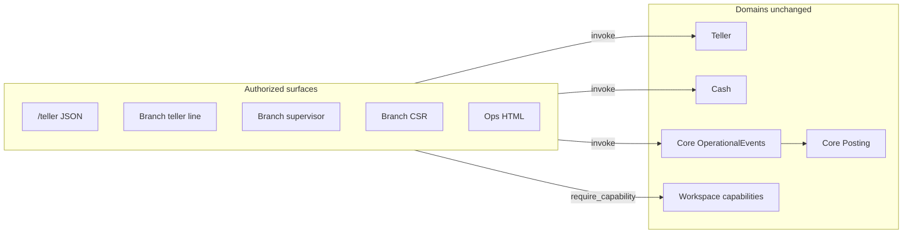

# ADR-0037: Internal staff authorized surfaces

## Status

Proposed

## Date

2026-04-30

## Aligns with

[Module catalog](../architecture/bankcore-module-catalog.md) (workspace vs domain ownership), [ADR-0014](0014-teller-sessions-and-control-events.md), [ADR-0015](0015-teller-workspace-authentication.md), [ADR-0025](0025-internal-workspace-ui.md), [ADR-0026](0026-branch-csr-servicing.md), [ADR-0029](0029-capability-first-authorization-layer.md), [ADR-0031](0031-cash-inventory-and-management.md), [ADR-0039](0039-teller-session-drawer-custody-projection.md), [roadmap branch operations Phase 2](../roadmap-branch-operations.md#6-phase-2-cash-custody-and-branch-controls)

---

## 1. Context

Branch staff need clear boundaries between **routine line work**, **supervisory approvals**, and **customer/account servicing** without duplicating domain logic. BankCORE already separates **workspaces** (Rails controllers under `branch`, `ops`, `admin`, plus JSON `/teller`) from **domains** (`Teller`, `Cash`, `Accounts`, `Core`, …).

Segregation-of-duties and audit expectations vary by action: teller session variance, cash movement approval, reversals, fee waivers, and business-date close are not interchangeable with CSR read paths. A single hardcoded `role` string is insufficient long term; capabilities already model coarse authority ([ADR-0029](0029-capability-first-authorization-layer.md)).

The risk is **organizational confusion** leading contributors to introduce parallel domains (for example `TellerSupervisor`) or to scatter authorization in views instead of at controller or command boundaries.

---

## 2. Decision

**Authorized surfaces** are **staff entry points**: route namespaces, controller groups, navigation lanes, or API workspaces. They **orchestrate** and **gate** access; they **do not** own durable financial or custody state.

**Domains** remain the single owners of invariants and tables (`Teller`, `Cash`, `Core::OperationalEvents`, `Accounts`, …). Multiple surfaces may invoke the **same** domain command; authorization uses **`Workspace`** capability resolution ([ADR-0029](0029-capability-first-authorization-layer.md)).

At the **branch** HTML level, three **logical** surfaces match common branch operating roles (implemented as capability-gated areas under `app/controllers/branch/`, not as three separate domain modules):

| Surface | Primary intent | Typical capabilities / notes |
| --- | --- | --- |
| **Teller (line)** | Teller session lifecycle, cash-affecting transactions, custody actions the line may **initiate**; operational events often use channel **`teller`** when session rules apply ([ADR-0014](0014-teller-sessions-and-control-events.md)). | Seeded **Teller** role bundle includes deposit/withdrawal/transfer, session open/close, cash movement **create**, count, position view, etc. |
| **Teller supervisor** | Approvals and elevated controls: session variance approval, cash movement **approve**, reversals, business date close, and other supervisor-gated actions. | Seeded **Branch Supervisor** (and relevant **Operations**) bundles; same `Branch` namespace, different capability checks than line-only screens. |
| **CSR** | Customer/account **servicing** (search, 360, profile, holds, guarded servicing writes) with channel **`branch`** for non-cash HTML actions ([ADR-0026](0026-branch-csr-servicing.md)). | Seeded **CSR** role; overlaps with supervisor for specific actions (for example fee waive) remain **capability-driven**, not a second app. |

**Fourth surface (machine-oriented):** JSON **`/teller`** with **`X-Operator-Id`** ([ADR-0015](0015-teller-workspace-authentication.md)) — integration and parity testing; same underlying commands as much of the teller line where applicable.

**Rules**

- Prefer `Authorizer` / `require_capability!` at **controller** or **command** entry; avoid encoding conditional business rules **inside** capability codes ([ADR-0029](0029-capability-first-authorization-layer.md) §2).
- **Do not** split the `Teller` domain by job title; supervisor behavior stays in shared commands (`ApproveSessionVariance`, etc.) behind capability checks.
- One **operator** may use more than one surface when their role assignments include the union of required capabilities.

---

## 3. Non-goals

- Renaming or replacing JSON **`/teller`** routes or changing **`X-Operator-Id`** semantics ([ADR-0015](0015-teller-workspace-authentication.md)).
- Mandating three separate Rails route **root** namespaces for branch HTML; multiple surfaces may share `branch` paths with distinct nav or controller groups ([ADR-0025](0025-internal-workspace-ui.md)).
- Defining mixed-deposit tickets, check imaging, denomination tracking, or full shipment lifecycle (remain under future ADRs / [ADR-0031](0031-cash-inventory-and-management.md)).

---

## 4. Consequences

- New Branch UI may introduce **supervisor-only** routes or nav sections without new domains; tests should assert **403** / redirect when capabilities are missing.
- Documentation and capability map should name these surfaces so contributors do not invent parallel modules.
- **Cash custody** vs **teller session expected cash** remains governed by [ADR-0031](0031-cash-inventory-and-management.md), [ADR-0014](0014-teller-sessions-and-control-events.md), and [ADR-0039](0039-teller-session-drawer-custody-projection.md); this ADR only clarifies **where** staff initiate or approve those flows in the UI.

---

## 5. Related documents

- Branch cash operating model (target): [301-branch-level-cash-tracking.md](../concepts/301-branch-level-cash-tracking.md)
- Bank-wide capability taxonomy (families **F1–F17** vs execution channel): [303-bank-transaction-capability-taxonomy.md](../concepts/303-bank-transaction-capability-taxonomy.md)
- Capability summary: [branch-operations-capability-map.md](../architecture/branch-operations-capability-map.md)

---

## 6. Implementation notes (Branch HTML)

Shipped wiring:

- **Surface nav:** [app/views/branch/shared/_surface_nav.html.erb](../../app/views/branch/shared/_surface_nav.html.erb) is rendered from [app/views/layouts/internal.html.erb](../../app/views/layouts/internal.html.erb) when `controller_path` starts with `branch/`; durable lane URLs include `/branch/teller` and `/branch/approvals`, while legacy dashboard anchors still match `id` sections on [app/views/branch/dashboard/index.html.erb](../../app/views/branch/dashboard/index.html.erb) (`#csr`, `#teller`, `#supervisor`).
- **HTML aliases:** Branch HTML may expose friendlier route paths such as `/branch/events` and `/branch/accounts/:id` while preserving underlying controller/domain names (`OperationalEvents`, deposit account servicing). These aliases are authorized surfaces, not domain renames.
- **Branch teller inputs:** Branch HTML deposit/withdrawal forms collect operator-facing account number, decimal amount, and open teller-session selection, then normalize those inputs into the existing `RecordEvent` / `AuthorizeDebit` command contracts. JSON `/teller`, posting/idempotency semantics, and teller-session policy remain unchanged.
- **Capability-gated links:** [Branch::ApplicationController](../../app/controllers/branch/application_controller.rb) exposes `branch_operator_can?` to views; dashboard links use `Workspace::Authorization::CapabilityRegistry` constants.
- **Teller session close:** Branch HTML and JSON **`/teller`** submit **actual** count inputs only; **`CloseSession`** computes **expected** cash internally ([ADR-0039](0039-teller-session-drawer-custody-projection.md)); UI may still **display** computed expected for operator guidance.
- **Teller session variance on Branch:** `POST /branch/teller_sessions/approve_variance` on [Branch::TellerSessionsController](../../app/controllers/branch/teller_sessions_controller.rb); pending rows include an approve form in [app/views/branch/dashboard/_session_group.html.erb](../../app/views/branch/dashboard/_session_group.html.erb) when `variance_approve: true`.
- **Override approval:** capability `override.approve` ([CapabilityRegistry](../../app/domains/workspace/authorization/capability_registry.rb)); enforced on [Branch::OverridesController](../../app/controllers/branch/overrides_controller.rb) and [Teller::OverridesController](../../app/controllers/teller/overrides_controller.rb).
